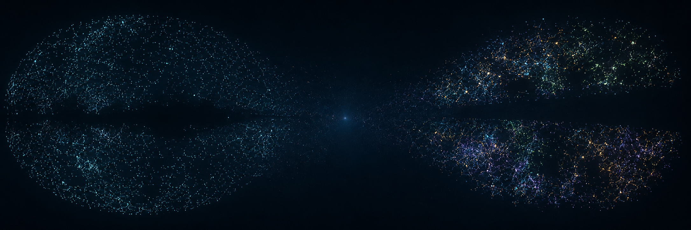

# NĀSADĪYA LIGHTCONE

> **A survey-native browser and research workflow for navigating measured galaxy catalogues through redshift, distance, and cosmic time.**

Created and developed by **Biswajit Jana**.

[](https://biswajit1999.github.io/NASADIYA-LIGHTCONE/)
[](https://colab.research.google.com/github/Biswajit1999/NASADIYA-LIGHTCONE/blob/main/notebooks/DESI_DR1_LSS_3D_Colab.ipynb)
[](docs/research-mode.md)
[](docs/sources.md)
[](docs/sources.md)
[](data/processed/desi-dr1/overview.json)
[](../../actions/workflows/ci.yml)
[](LICENSE)
[](DATA_POLICY.md)

<p align="center">
  <a href="https://biswajit1999.github.io/NASADIYA-LIGHTCONE/"><strong>Launch the live explorer →</strong></a>
  &nbsp;·&nbsp;
  <a href="https://colab.research.google.com/github/Biswajit1999/NASADIYA-LIGHTCONE/blob/main/notebooks/DESI_DR1_LSS_3D_Colab.ipynb"><strong>Open the Colab workflow →</strong></a>
</p>



NĀSADĪYA LIGHTCONE does not fabricate a cosmic web. Every rendered point originates in a published survey product, preserves source provenance, and remains separate from any future derived density or reconstruction layer. The project currently connects a nearby 2MRS anchor to a deep DESI DR1 LSS layer, with a separate Python workflow for research-scale DESI analysis.

## Two complementary ways to explore the data

| Mode | Intended use | Data behaviour |
|---|---|---|
| **[Live Explorer](https://biswajit1999.github.io/NASADIYA-LIGHTCONE/)** | Fast public WebGL exploration | Loads the full 2MRS local layer and a deterministic 125,000-row DESI overview. Local or future remote tile delivery can add camera-relevant DESI detail without a multi-million-row initial download. |
| **[Research Mode](docs/research-mode.md)** | Colab, Python analysis and publication-quality figures | Builds a compressed Parquet bundle from the local DESI tile store, then scans the complete bundle for statistics while rendering a bounded deterministic subset in 3D. |

## Current data inventory

| Layer | Measurement | Current status |
|---|---|---|
| **2MRS Table 3** | Nearby spectroscopic recession velocities | **43,533 observed rows** in the public local-Universe layer |
| **DESI DR1 LSS** | Spectroscopic BGS, LRG, ELG and QSO large-scale-structure catalogues | **6,093,818 accepted observed rows** in the local build; **4,205** local spatial tiles; **125,000 deterministic real rows** in the public browser overview |
| **Available-survey stack** | 2MRS + DESI DR1 comparison view | **168,533 public rendered records**: 43,533 full 2MRS rows plus 125,000 DESI overview rows. This is explicitly non-deduplicated, not a unique-galaxy count. |
| **2MPZ** | Photometric redshifts | Not ingested. A verified downloadable source table with per-object photo-z uncertainty is required before a tile build. |
| **WISE × SuperCOSMOS** | Photometric redshifts | Not ingested. It requires the same source-table and uncertainty validation gate. |
| **Gaia DR3 / GCNS** | Stellar astrometry and parallax | Planned as a separate Milky Way mode. Gaia is never merged into extragalactic galaxy counts. |

> The public DESI overview is a browser level-of-detail layer, not a scientific subsample. It is selected deterministically from real source rows so the public build remains reproducible. Raw DESI FITS archives, full tiles and research Parquet bundles remain outside ordinary Git history.

## Live explorer

**Website:** [biswajit1999.github.io/NASADIYA-LIGHTCONE](https://biswajit1999.github.io/NASADIYA-LIGHTCONE/)

The map-first explorer provides local 2MRS Cartesian slices, observer-centred radial views, a DESI deep-field layer, DESI tracer controls, point-level source inspection, an available-survey comparison stack and public methods/data documentation.

- [About the project](about.html)
- [Public data ledger](data.html)
- [Methods note](methods.html)
- [Community guide](community.html)
- [Available-survey comparison stack](docs/available-survey-stack.md)
- [Adaptive DESI tile delivery](docs/desi-adaptive-tiles.md)

## Research-resolution DESI workflow

The browser is intentionally not a 6-million-row download. Build a capped, portable research bundle from your full local DESI tile store:

```cmd
.\.venv\Scripts\python.exe -m pip install -r requirements.txt

.\.venv\Scripts\python.exe scripts\build_desi_research_bundle.py --target-mb 480 --overwrite

.\.venv\Scripts\python.exe scripts\plot_desi_research_figure.py --input data\research\desi_dr1_lss_research_bundle.parquet --output-dir figures --render-rows 120000
```

The builder first attempts a compressed Parquet file containing all observed DESI tile rows. If it exceeds the requested 480 MiB cap, it creates a deterministic object-ID-hash sample and writes an adjacent manifest documenting the exact selection, input count, output count, file hash and tracer counts.

Generated files:

```text
data/research/desi_dr1_lss_research_bundle.parquet
data/research/desi_dr1_lss_research_bundle.manifest.json
figures/desi_dr1_lss_3d_research_view.png
figures/desi_dr1_lss_redshift_summary.png
figures/desi_dr1_lss_research_summary.json
```

The Parquet bundle is ignored by normal Git history and should be published as a versioned GitHub Release asset. The small validated PNG/JSON figure outputs can be committed to `figures/` with the relevant manifest.

### Google Colab

Use [DESI DR1 LSS 3D Colab](https://colab.research.google.com/github/Biswajit1999/NASADIYA-LIGHTCONE/blob/main/notebooks/DESI_DR1_LSS_3D_Colab.ipynb) to upload a research bundle or load a future release-asset URL. The notebook produces the same reproducible 3D and redshift-distribution figures.

Read [docs/research-mode.md](docs/research-mode.md) for the complete workflow and scientific boundary.

## Scientific guardrails

- No generated galaxies, interpolated filaments or decorative density points are stored as observed catalogue objects.
- Survey footprint, masking, target selection and incompleteness are visualised as measurement limits. Empty regions do **not** establish low physical density.
- 2MRS local placement uses `z ≈ cz / c` and a Planck18 comoving-distance transform only for visual navigation; local peculiar velocities matter.
- DESI DR1 LSS is a deep spectroscopic footprint, not an all-sky reconstruction. Its separated North/South regions are expected survey geometry.
- The 2MRS + DESI stack is a provenance-preserving comparison view, not a cross-matched or completeness-corrected master catalogue.
- Photometric-redshift layers must carry a published **per-object** uncertainty and cannot be presented as exact radial positions.
- Gaia is a stellar astrometry catalogue and remains separate from extragalactic source counts.
- Derived products must have a distinct identifier, method description and citation; they may not silently blend with observed-point layers.

Read [docs/scientific-scope.md](docs/scientific-scope.md) before using the visualisation for scientific interpretation.

## Local setup

```cmd
python -m venv .venv
.\.venv\Scripts\python.exe -m pip install --upgrade pip
.\.venv\Scripts\python.exe -m pip install -r requirements.txt

.\.venv\Scripts\python.exe -m http.server 8080
```

Open `http://localhost:8080`. Do not double-click `index.html`: browser module security prevents it from loading local JSON products directly.

For a clean clone that does not yet contain generated data, build the 2MRS baseline:

```cmd
.\.venv\Scripts\python.exe scripts\download_2mrs.py
.\.venv\Scripts\python.exe scripts\build_2mrs_lightcone.py
.\.venv\Scripts\python.exe scripts\verify_browser_catalog.py
```

## Build the deep DESI layer locally

The DESI builder downloads official DR1 LSS source FITS products, validates and converts rows, then creates a spatial tile store plus a deterministic browser overview.

```cmd
.\.venv\Scripts\python.exe scripts\download_desi_dr1_lss.py --dry-run
.\.venv\Scripts\python.exe scripts\download_desi_dr1_lss.py --yes
.\.venv\Scripts\python.exe scripts\build_desi_dr1_tile_store.py
```

### Data boundary

```text
data/raw/desi-dr1/                   # official downloaded source FITS files — local only
data/processed/desi-dr1/tiles/       # full local spatial tile store — local only
data/processed/desi-dr1/index.json  # compact public index — committed
data/processed/desi-dr1/overview.json # 125,000-row public browser overview — committed
data/research/                       # release-ready Parquet bundles — ignored by Git
figures/                             # small validated PNG/PDF/JSON outputs may be committed
```

## Community and documentation

- [Getting started](docs/getting-started.md)
- [Data access and hosting model](docs/data-access.md)
- [Research-mode guide](docs/research-mode.md)
- [Next survey build workflow](docs/next-survey-build.md)
- [Community guide](COMMUNITY.md)
- [Contribution guide](CONTRIBUTING.md)
- [Scientific scope](docs/scientific-scope.md)
- [Sources and survey acknowledgement](docs/sources.md)
- [Project report in LaTeX](report/NASADIYA_LIGHTCONE_Project_Report.tex)
- [Explorer UI/UX and SEO audit](docs/ui-ux-seo-audit-v1.md)

## Repository layout

```text
NASADIYA-LIGHTCONE/
├── src/                                # Browser modules and WebGL view
├── pipeline/nasadiya_lightcone/         # Validation, cosmology and tile store
├── scripts/                             # Download, build, probe and plotting commands
├── notebooks/                           # Google Colab research workflow
├── data/registry/                       # Layer registry and public contracts
├── data/raw/                            # Source downloads — ignored by Git
├── data/processed/2mrs/                 # Compact 2MRS browser product
├── data/processed/desi-dr1/             # Public index/overview; full tiles ignored
├── data/research/                       # Release-ready Parquet bundles — ignored by Git
├── figures/                             # Small reproducible research outputs
├── docs/                                # Methods, data access and research workflow
├── report/                              # LaTeX technical project report and bibliography
├── tests/                               # Parser, cosmology, tile-store and UI contracts
└── .github/                             # CI, issue templates and pull-request template
```

## Checks

```cmd
.\.venv\Scripts\python.exe -m pytest -q
.\.venv\Scripts\python.exe -m ruff check pipeline scripts tests
npm run check:modules
```

## Citation and licence

Code is released under the [MIT License](LICENSE). Please cite the software using [CITATION.cff](CITATION.cff) **and** cite every survey catalogue used in a visualisation or analysis. Survey data retain their original licences, terms, acknowledgements and attribution requirements; they are not relicensed by this repository.
